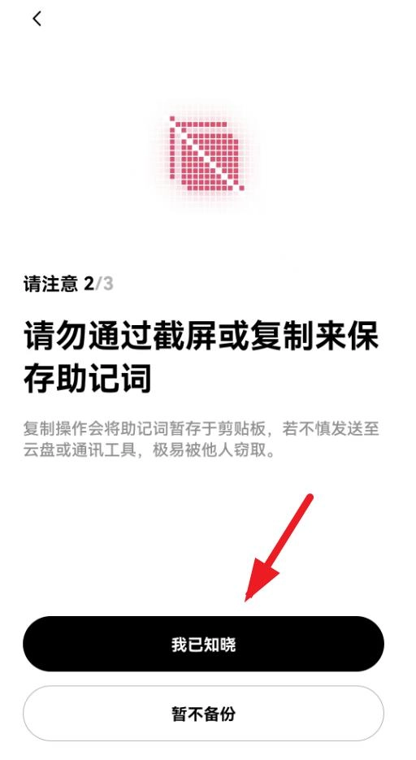
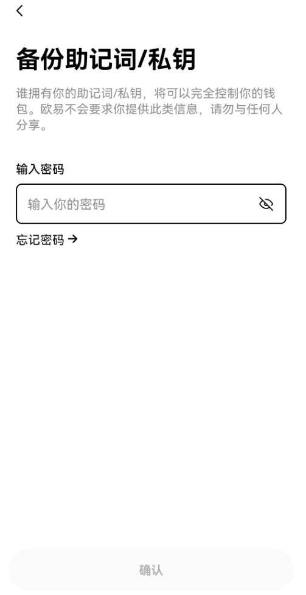
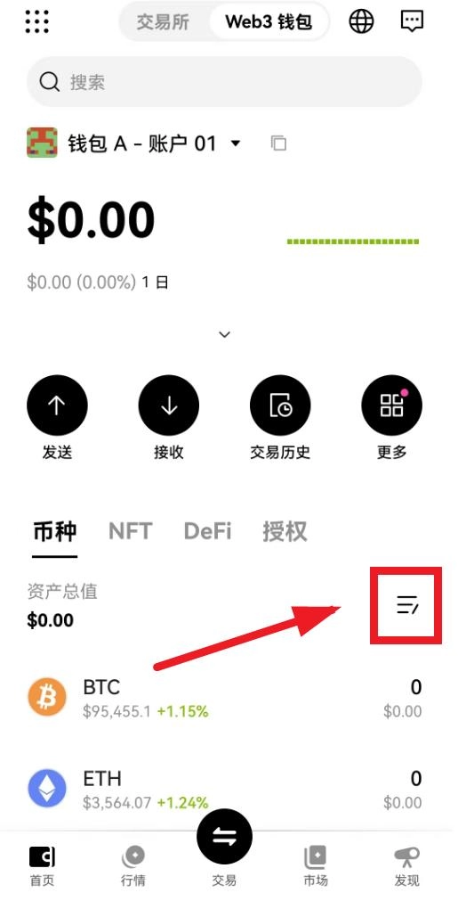

# OKX Web3钱包创建指南：从零开始的完整操作流程

---

想用Web3钱包但不知道从哪开始？OKX Web3钱包支持近百条公链，自己掌管私钥和资产，不需要懂复杂的技术概念。这篇文章手把手教你完成注册、创建和基本使用，看完就能上手操作。

---

说实话,第一次接触Web3钱包的时候,我也挺懵的。什么助记词、公链、DApp,听起来都挺吓人。但用了OKX Web3钱包之后发现,其实没那么复杂——它就是个数字版的钱包,只不过存的不是人民币,而是比特币、以太坊这些数字货币。

OKX Web3钱包跟传统钱包最大的区别在于:资产真的是你自己的。私钥在你手里,不是放在某个公司的服务器上。这听起来有点抽象,简单说就是——只要你保管好助记词,谁也动不了你的钱。

## 先注册个账号

首先得有个OKX账号。用你的QQ邮箱或者163邮箱都行,填进去就能开始注册流程。

地区选择跟你身份证一致的就行,比如你是中国人就选中国。然后确认邮箱地址,点注册,输入收到的验证码。

接下来绑定手机号,+86的就可以,再输入手机验证码。最后创建密码——注意密码格式要有大小写字母、数字、符号的组合,不然过不了。

这样就注册好了。如果前面没下载APP,可以在总览页面底部点下载。顺便建议完成身份认证,按提示操作就行,完成了还有奖励,以后还能用微信或支付宝买比特币。

## 登录进去

APP下载安装好后,打开进行登录。点注册/登录按钮,然后点"已有账号登录",用你刚注册的手机号或邮箱登录就行。

登录之后可以创建通行密钥,这样以后就不用每次输密码了,直接指纹或面容识别就能进。

## 创建钱包——重点来了

在APP顶部有两个选项:一个是交易所,一个是Web3钱包。点Web3钱包切换过去,就进入创建流程了。

点"创建钱包"——"立即创建"——设置一个钱包密码(可以跟登录密码设一样的,方便记)并继续。这时钱包已经创建好了,但还没完。

接下来要立即备份钱包。建议用手动备份,这样资产才真正掌握在自己手里。看完三个注意事项后,点"立即备份",输入钱包密码。

**这一步很关键**:点中间的图标显示助记词。这些词一定要用笔和纸抄下来,放到安全的地方。千万别截图保存在手机里或者发到微信上——谁拿到这些词,谁就能动你的资产。想了解更多Web3钱包的安全设置,👉 [点这里查看完整的安全操作指南](https://www.okx.com/join/62834398)。

抄完之后点继续,系统会让你确认一下助记词,验证你是不是真的记下来了。确认完成,钱包就创建好了。

## 基本使用

钱包创建好后,可以点三横图标自定义添加或删除币种。你想放什么币就加什么,不需要的可以隐藏掉。

要接收比特币或其他币,点"接收",选择对应的币种。比如接收BTC,默认选第一个就行,用来接收比特币。

接收到比特币后,还可以在"市场"里用它买铭文、符文(runes)、NFT这些东西。具体怎么操作就看你自己的需求了。

---

说白了,OKX Web3钱包就是个自己管理资产的工具。它支持近百条公链,转账收款、连接DApp、买卖NFT这些功能都有,操作起来也不复杂。关键是私钥在你手里,资产安全由自己掌控。如果你需要一个去中心化、功能全面的数字钱包,👉 [使用邀请码62834398注册OKX](https://www.okx.com/join/62834398),可以获得新手福利,还能体验完整的Web3生态服务。
